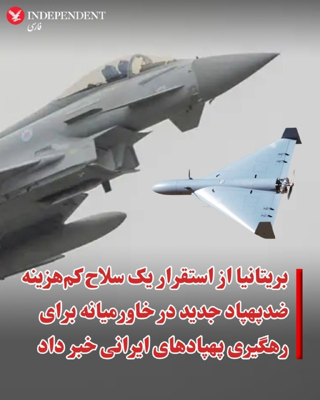
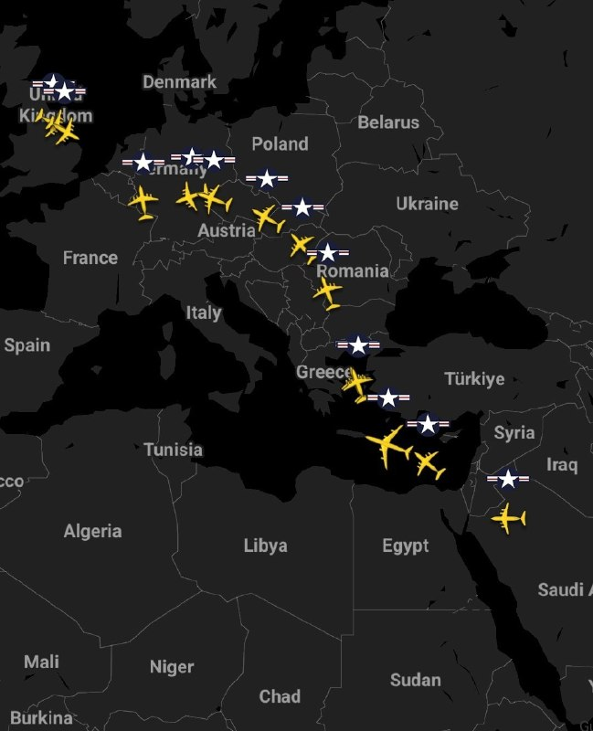
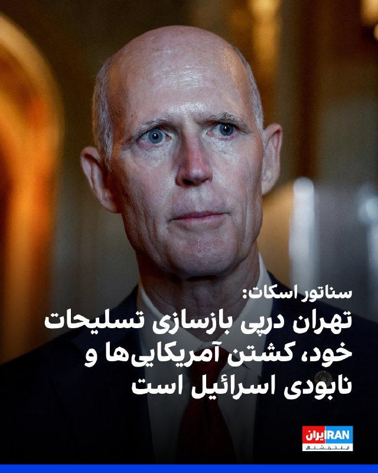

# خواننده تلگرام

<!-- TOP_NAV START -->

<!-- TOP_NAV END -->

<!-- MSG START -->

---
📅 بروزرسانی: 1405/02/27 09:32
---

## VahidOOnLine — post 240566

  

عبدالغفور امان‌زاده، عضو کمیسیون کشاورزی مجلس، با اعلام افزایش ۲۰ هزار تومانی قیمت گندم، گفت: «نگرانی اصلی کشاورزان بابت پرداخت مطالبات و پول گندم است. از آغاز فصل برداشت تا امروز حدود ۴۵ روز می‌گذرد اما متاسفانه دیناری بابت این مسئله به کشاورزان پرداخت نشده است.»
‌🏁 🇬🇧 IranintlTV

🤖 @VahidOOnLine

## VahidOOnLine — post 240565

  <a href="telegram/content/VahidOOnLine_240565_1778997740.mp4" target="_blank">🎬 Download video</a>

⭕️ صدو‌سی‌امین سال ترور قبله عالم، ناصرالدین شاه قاجار و تاثیر آن بر وقایع سیاسی ایران

♦️دوازدهم اردیبهشت‌ماه ۱۲۷۵ خورشیدی، هنگامی که ناصرالدین‌شاه قاجار به مناسبت پنجاهمین سال سلطنتش راهی حرم عبدالعظیم در شهر ری شد و برخلاف روال همیشگی، از ملازمان خود خواست اجازه دهند مردم برای دیدار به او نزدیک شوند، شاید هرگز تصور نمی‌کرد که این سفر، واپسین سفر زندگی‌اش باشد و همان روز و در همان مکان، به دست میرزا رضای کرمانی کشته شود.
اکنون ۱۳۰ سال از ترور ناصرالدین‌شاه می‌گذرد؛ رویدادی که تاریخ معاصر ایران را، از منظر حذف فیزیکی عالی‌ترین مقام حکومت، به پیش و پس از خود تقسیم کرد.
میرزا رضای کرمانی که از مریدان سید جمال‌الدین اسدآبادی بود و سال‌هایی از عمر خود را در زندان گذرانده بود، در آن روز در میان زائران کمین کرد. هنگامی که شاه از کالسکه پیاده شد و به سوی صحن حرم گام برداشت، خود را به او رساند و از فاصله‌ای نزدیک گلوله‌ای به سینه او شلیک کرد.
ناصرالدین‌شاه در همان لحظه نقش بر زمین شد. ندیمان و محافظان شاهی که غافلگیر شده بودند، بلافاصله میرزا رضا را دستگیر کردند.

📌لینک پخش پادکست
‌🇸🇦 Indypersian

🤖 @VahidOOnLine

## VahidOOnLine — post 240564

  

فرماندهی مرزبانی استان بوشهر اعلام کرد یکشنبه عملیات انفجار و حریق کنترل‌شده برای امحای مواد و ضایعات بمب در محدوده باشی، بین شهرستان‌های تنگستان و دشتی، انجام می‌شود. این عملیات از ساعت ۸ تا ۱۷ برگزار می‌شود.
‌🏁 🇬🇧 IranintlTV

🤖 @VahidOOnLine

## VahidOOnLine — post 240563

  

‌♦️وزارت دفاع بریتانیا از استقرار یک سلاح کم‌هزینه ضدپهپاد جدید در خاورمیانه برای رهگیری پهپادهای ایرانی خبر داد. بنا بر اعلام این وزارتخانه جت‌های تایفون نیروی هوایی سلطنتی بریتانیا به سیستم سلاح پیشرفته کشتار دقیق «ای‌پی‌کی‌دابلیو‌اس» مجهز می‌شوند که با استفاده از هدف‌گیری لیزری، موشک‌های غیرهدایتی را به سلاح‌های دقیق و کم‌هزینه تبدیل می‌کند که قادر به سرنگونی پهپادها و دیگر تهدیدها هستند.
وزارت دفاع بریتانیا گفت این سامانه را در همکاری سریع با صنایع نظامی ظرف چند ماه از مرحله آزمایش به مرحله استقرار رسانده است و با این اقدام شهروندان بریتانیایی و شرکای منطقه‌ای از حفاظت بیشتری در برابر حملات پهپادی برخوردار خواهند شد.
‌🇸🇦 Indypersian

🤖 @VahidOOnLine

## VahidOOnLine — post 240562

  

ریک اسکات، سناتور جمهوری‌خواه آمریکایی، به فاکس‌نیوز گفت جمهوری اسلامی با وجود جنگ اخیر همچنان به دنبال کشتن آمریکایی‌ها، بازسازی تسلیحات خود و نابودی اسرائیل است.
او همچنین گفت تهران همچنان از حماس، حزب‌الله و حوثی‌ها حمایت می‌کند و در عین حال از رویکرد ترامپ در قبال ایران در تنگه هرمز تمجید کرد.

‌🏁 🇬🇧 IranintlTV

🤖 @VahidOOnLine

## VahidOOnLine — post 240561

  

♦️به گزارش خبرگزاری رویترز، دولت دونالد ترامپ روز شنبه با تمدید نکردن معافیت‌های تحریمی خرید نفت دریاپایه روسیه، اجازه داد این مجوز قانونی منقضی شود. این معافیت یک‌ماهه پیش از این با هدف جبران کمبود عرضه نفت و کنترل قیمت‌های جهانی پس از انسداد تنگه هرمز توسط جمهوری اسلامی، به کشورهایی مانند هند اعطا شده بود. اسکات بسنت، وزیر خزانه‌داری آمریکا، پیش‌تر اعلام کرده بود که این مجوز عمومی را برای خرید نفت ذخیره‌شده روسیه در نفت‌کش‌ها تمدید نخواهد کرد.
لغو این معافیت در حالی صورت می‌گیرد که فشارها بر کاخ سفید افزایش یافته است؛ به طوری که دو سناتور دموکرات، جین شاهین و الیزابت وارن، روز جمعه از دولت ترامپ خواسته بودند به دلیل تامین مالی جنگ روسیه در اوکراین و عدم تاثیر آن بر کاهش هزینه‌های سوخت شهروندان آمریکایی، این معافیت را ملغی کند. هند که بزرگترین خریدار نفت دریاپایه روسیه است، در پی معافیت‌های قبلی، خریدهای خود را در ماه‌های آوریل و مه به اوج رسانده بود.
‌🇸🇦 Indypersian

🤖 @VahidOOnLine

## VahidOOnLine — post 240560

  

بری روزن، گروگان پیشین سفارت آمریکا در ایران، در ایکس نوشت جمهوری‌اسلامی در جریان درگیری با ایالات‌متحده، برای سرکوب مخالفت‌ها بر شمار اعدام‌ها افزوده است و مقام‌های ایرانی از اعدام‌ها و احکام قضایی برای ارعاب معترضان احتمالی استفاده می‌کنند.
‌🏁 🇬🇧 IranintlTV

🤖 @VahidOOnLine

## VahidOOnLine — post 240559

  <a href="telegram/content/VahidOOnLine_240559_1778997744.mp4" target="_blank">🎬 Download video</a>

♦️ویدیوهای رسیده به ایندیپندنت فارسی نشان می‌دهد ایرانیان واشنگتن‌دی‌سی روز شنبه ۲۶ اردیبهشت، هم‌زمان با ایرانیان در دیگر کشورهای جهان، با تشکیل زنجیره انسانی روی «پل کلید» تجمع اعتراضی برگزار کردند.
شرکت‌کنندگان در این تجمع با اهتزاز پرچم‌های شیر‌‌و‌خورشید و حمل پلاکاردهایی خواستار آزادی زندانیان سیاسی، توقف احکام اعدام و پایان محدودیت‌ها و قطعی اینترنت در ایران شدند.
‌🇸🇦 Indypersian

🤖 @VahidOOnLine

## VahidOOnLine — post 240558

♦️دونالد ترامپ با انتشار تصاویری در صفحه اینستاگرام خود از سفرش به چین، به پیشینه روابط دیرینه میان دو کشور اشاره کرد و گفت: «رابطه میان مردم آمریکا و چین به زمان تاسیس آمریکا بازمی‌گردد و شهروندان ما از همان ابتدا احترام متقابل عمیقی برای یکدیگر قائل بوده‌اند.» او این پیوند تجاری و احترام‌آمیز ۲۵۰ ساله را پایه‌ای برای آینده‌ای دانست که به نفع هر دو ملت خواهد بود.
او در ادامه این ویدیو با اشاره به ویژگی‌های فرهنگی و انسانی مشترک میان دو جامعه افزود: «مردم آمریکا و چین اشتراکات زیادی دارند؛ ما برای کار سخت، شجاعت و موفقیت ارزش قائلیم و به خانواده‌ها و کشورهای خود عشق می‌ورزیم.»
‌🇸🇦 Indypersian

🤖 @VahidOOnLine

## mwarmonitor — post 9184

🔴گزارش شده فعالیت هواپیماهای سوخت‌رسان آمریکایی در آسمان استان الانبار در غرب عراق؛ این پروازها از فرودگاه بن‌گوریون به‌سمت خاک عراق به پرواز درآمده‌اند. حضور چنین نوعی از هواپیماها نشان‌دهنده وجود پروازهای جنگی و جاسوسی در آسمان عراق است که به عملیات پشتیبانی و لجستیکی نیاز دارند…»

@mwarmonitor

## mwarmonitor — post 9183

📝 خدا نشسته اون بالا، تخمه می‌شکنه و با لذت به این شاهکار نگاه می‌کنه؛ کمدی سیاهی که در آن ابولا و هانتا ویروس مأمور پذیرایی هستند و جنگ‌ها نقش موسیقی متن را بازی می‌کنند. آدم با دیدن این حجم از خلاقیت در شکنجه و متدِ «عذاب بده و بگو مصلحت است»، به شک می‌افتد که نکند خدای کائنات هم یک آخوند شیعه رافضی است که این‌طور از زجر دادن خلق‌ لذت می‌برد! در این تراژدی تمام‌عیار، بشر حتی باید برای یک شهاب‌سنگ شیک هم التماس کند؛ اما کارگردان اون بالا ترجیح می‌دهد با زجرکش کردنِ ما لذت داستان را کش بدهد، چون یک انقراض فوری و بی‌دردسر، کل جذابیت این بازی کثیف را خراب می‌کند.

@mwarmonitor

## mwarmonitor — post 9182

🦠«یک شیوع جدید از ویروس بسیار مسری ابولا در استان اییتوری در شرق کنگو تأیید شده است، به گفته نهاد اصلی بهداشت عمومی آفریقا. تاکنون ۲۴۶ مورد مشکوک و ۶۵ مرگ ثبت شده است.» @mwarmonitor

## mwarmonitor — post 9181

  

✈️از چند ساعت گذشته بیش از دوازده فروند هواپیمای ترابری راهبردی C-17A گلوبمستر III نیروی هوایی آمریکا در حال ترک خاورمیانه و حرکت به سمت اروپا هستند. @mwarmonitor

## mwarmonitor — post 9180

  <a href="telegram/content/mwarmonitor_9180_1778997747.mp4" target="_blank">🎬 Download video</a>

✈️🇷🇺«یک پرواز تخلیه نیروی هوایی روسیه چند ساعت پیش از امارات متحده عربی به سمت روسیه حرکت کرد؛ همان‌طور که پیش‌بینی می‌شد، پس از آن‌که دیروز از موگادیشو فرود آمده بود تا افراد مهم یا محموله‌ای را سوار کرده و تخلیه کند.
🔸دقیقاً همین پرواز در تاریخ ۲۴ فوریه نیز انجام شده بود؛ درست پیش از آن‌که حملات آمریکا علیه ایران رخ دهد.»

@mwarmonitor

## mwarmonitor — post 9179

  

🚨✈️ به نظر می‌رسد آسمان‌ها در حال حاضر به‌طور نگران‌کننده‌ای آرام هستند. حتی هیچ پرواز باری ورودی قابل مشاهده‌ای وجود ندارد، به‌جز یک فروند C-17 که همین حالا در اردن فرود آمده است. ✈️آخرین پروازهای باری نظامی در حال خارج شدن از خاورمیانه هستند. @mwarmonitor

## FoxNewsTwitter — post 341828

  

Fox News (Twitter/X)

BREAKING: Senator Bill Cassidy has been defeated.

More than five years after voting to convict President Trump in his impeachment trial, the Louisiana Republican senator has lost in his GOP primary.

In a Truth Social post, Trump reacted, saying “his disloyalty to the man who got him elected is now a part of legend, and it’s nice to see that his political career is OVER!”

Trump-backed Rep. Julia Letlow and Louisiana Treasurer John Fleming finished ahead of Cassidy, according to the AP, and will now face off in next month’s runoff.

## pm_afshaa — post 90879

  

توییت جدید اتاق جنگ اسرائیل:

⌛

💧 Rainbet.com the #1 Non-KYC Crypto Casino & Sportsbook @rainbetcom

😁 @Pm_Afshaa

## IranIntlTV — post 337569

  <a href="telegram/content/IranIntlTV_337569_1778997750.mp4" target="_blank">🎬 Download video</a>

روزنامه تهران‌تایمز، وابسته به سازمان تبلیغات اسلامی، نوشت محاصره دریایی ایران از سوی آمریکا باعث تغییر استراتژیک در لجستیک و ترانزیت منطقه‌ای شده است.
جزییات بیشتر با احمد علوی، استاد دانشگاه و اقتصاددان
@iranintltv

## IranIntlTV — post 337568

  <a href="telegram/content/IranIntlTV_337568_1778997752.mp4" target="_blank">🎬 Download video</a>

شهباز شریف، نخست‌وزیر پاکستان، در گفت‌وگو با روزنامه تایمز بریتانیا گفت اسلام‌آباد نسبت به دستیابی صلح پایدار میان آمریکا و جمهوری اسلامی خوش‌بین است و برای تضمین این صلح، تمام تلاش خود را به کار می‌گیرد.
جزییات بیشتر در گفت‌وگو با علیرضا نامور حقیقی، تحلیل‌گر سیاسی
@iranintltv

## IranIntlTV — post 337567

  

عبدالغفور امان‌زاده، عضو کمیسیون کشاورزی مجلس، با اعلام افزایش ۲۰ هزار تومانی قیمت گندم، گفت: «نگرانی اصلی کشاورزان بابت پرداخت مطالبات و پول گندم است. از آغاز فصل برداشت تا امروز حدود ۴۵ روز می‌گذرد اما متاسفانه دیناری بابت این مسئله به کشاورزان پرداخت نشده است.»
https://iranintl.com/202605174138

## IranIntlTV — post 337566

  <a href="telegram/content/IranIntlTV_337566_1778997754.mp4" target="_blank">🎬 Download video</a>

سندیکای کارگران نیشکر هفت‌تپه در بیانیه‌ای خواستار تعیین دستمزد ۷۰ میلیون تومانی برای کارگران در سال جاری شد. این تشکل مستقل کارگری هشدار داد ادامه شکاف میان دستمزدها و تورم، فاصله طبقاتی را عمیق‌تر خواهد کرد.
جزییات بیشتر با روزبه بوالهری، عضو تحریریه ایران‌اینترنشنال
@iranintltv

## IranIntlTV — post 337565

  <a href="telegram/content/IranIntlTV_337565_1778997756.mp4" target="_blank">🎬 Download video</a>

سازمان حقوق بشر ایران در بیانیه‌ای نسبت به نقش برخی وکلای تسخیری در تسریع روند صدور و اجرای احکام اعدام معترضان هشدار داد. پیش‌تر نیز جمعی از وکلای حقوق بشری در ایران، وکلای تسخیری را همدستان نهادهای امنیتی در «محاکمات نمایشی» توصیف کرده بودند.
گفت‌وگو با محمد اولیایی‌فرد، وکیل دادگستری و عضو اتحادیه بین‌المللی وکلا
@iranintltv

## IranIntlTV — post 337564

  <a href="telegram/content/IranIntlTV_337564_1778997757.mp4" target="_blank">🎬 Download video</a>

شهباز شریف، نخست‌وزیر پاکستان، در گفت‌وگو با روزنامه تایمز بریتانیا گفت اسلام‌آباد نسبت به دستیابی صلح پایدار میان آمریکا و جمهوری اسلامی خوش‌بین است و برای تضمین این صلح، تمام تلاش خود را به کار می‌گیرد.
جزییات بیشتر در گفت‌وگو با علیرضا نامور حقیقی، تحلیل‌گر سیاسی
@iranintltv

## IranIntlTV — post 337563

  <a href="telegram/content/IranIntlTV_337563_1778997759.mp4" target="_blank">🎬 Download video</a>

دونالد ترامپ در گفت‌وگوی تلفنی با شبکه «ب‌اف‌ام» فرانسه هشدار داد اگر مقام‌های جمهوری اسلامی توافق نکنند، با «وضعیت بسیار بدی» روبه‌رو خواهند شد.
گفت‌وگو با امیر گیتی، عضو تحریریه ایران‌اینترنشنال
@iranintltv

## IranIntlTV — post 337562

🔻سازمان جهانی بهداشت وضعیت اضطراری برای شیوع ابولا اعلام کرد

سازمان جهانی بهداشت اعلام کرده شیوع ابولا در کنگو و اوگاندا به سطح «وضعیت اضطراری بهداشت عمومی با نگرانی بین‌المللی» رسیده است؛ هرچند این نهاد تاکید دارد که شرایط کنونی معیارهای یک همه‌گیری جهانی را ندارد.

به گفته این سازمان، نبود واکسن یا درمان تایید شده برای گونه «بوندیبوگیو»، این شیوع را به وضعیتی «غیرعادی» تبدیل کرده است.

به گزارش رویترز، سازمان جهانی بهداشت یکشنبه ۲۷ اردیبهشت هشدار داد شیوع ابولا که ناشی از ویروس بوندیبوگیو است، می‌تواند فراتر از مرزهای جمهوری دموکراتیک کنگو و اوگاندا گسترش پیدا کند و کشورهای همسایه کنگو در معرض خطر بالای انتقال بیماری قرار دارند.

بر اساس اعلام این نهاد وابسته به سازمان ملل، تا روز شنبه در استان ایتوری در شرق جمهوری دموکراتیک کنگو، دست‌کم ۸۰ مورد مرگ مشکوک، هشت مورد تایید شده آزمایشگاهی و ۲۴۶ مورد مشکوک ابتلا در سه منطقه بهداشتی شامل بونیا، روامپارا و مونگبالو ثبت شده است.

وزارت بهداشت جمهوری دموکراتیک کنگو پیش‌تر نیز از مرگ ۸۰ نفر در پی شیوع جدید بیماری خبر داده بود.

سازمان جهانی بهداشت هشدار داده با توجه به نرخ بالای مثبت بودن نمونه‌های اولیه و افزایش موارد مشکوک، ابعاد واقعی شیوع ممکن است بسیار گسترده‌تر از موارد شناسایی‌شده باشد.
ثبت موارد انتقال فرامرزی
به گفته سازمان جهانی بهداشت، مواردی از انتقال بین‌المللی بیماری تاکنون ثبت شده است. در اوگاندا، دو مورد تایید شده ابتلا - از جمله یک مورد مرگ - در کامپالا، پایتخت این کشور، گزارش شده که مربوط به افرادی بوده که از جمهوری دموکراتیک کنگو سفر کرده بودند.

همچنین یک مورد تایید شده ابتلا در کینشاسا، پایتخت جمهوری دموکراتیک کنگو، در فردی که از استان ایتوری بازگشته بود، شناسایی شده است.

این نهاد از کشورها خواسته سازوکارهای ملی مدیریت بحران را فعال کنند، غربالگری در مرزها و مسیرهای اصلی را افزایش دهند و موارد تایید شده را فوراً قرنطینه کنند.

بر اساس توصیه سازمان جهانی بهداشت، افراد مبتلا یا کسانی که با موارد بیماری تماس داشته‌اند، نباید تا ۲۱ روز پس از مواجهه با ویروس سفر بین‌المللی انجام دهند، مگر در شرایط تخلیه پزشکی.

توصیه به باز نگه داشتن مرزها
با وجود هشدار درباره خطر گسترش بیماری، سازمان جهانی بهداشت از کشورها خواسته از بستن مرزها یا اعمال محدودیت بر سفر و تجارت خودداری کنند.

به گفته این سازمان، محدودیت‌های شدید ممکن است موجب افزایش عبورهای غیررسمی از مرزها شود؛ مسیری که کنترل و پایش بیماری را دشوارتر خواهد کرد.

اعلام وضعیت اضطراری بین‌المللی از سوی سازمان جهانی بهداشت معمولاً برای جلب توجه جهانی، تسریع هماهنگی میان کشورها و تقویت پاسخ به بحران‌های بهداشتی صادر می‌شود؛ اما این نهاد تاکید کرده که شیوع کنونی ابولا هنوز به سطح یک همه‌گیری جهانی نرسیده است.
🔗وب‌سایت ایران‌اینترنشنال
@iranintltv

## IranIntlTV — post 337561

🔻ترامپ با انتشار پیام «آرامش پیش از طوفان»، گمانه‌زنی‌ها درباره ازسرگیری حملات را تشدید کرد

دونالد ترامپ، رییس‌جمهوری آمریکا، با انتشار پیامی مبهم درباره ایران در شبکه اجتماعی تروث سوشال، هم‌زمان با گزارش‌ها درباره احتمال ازسرگیری حملات آمریکا و اسرائیل علیه جمهوری اسلامی، به گمانه‌زنی‌ها درباره اغاز دوباره درگیری‌ها دامن زده است.

ترامپ شنبه ۲۶ اردیبهشت تصویری تولیدشده با هوش مصنوعی را در حساب کاربری خود منتشر کرد که او را در کنار یک دریادار نیروی دریایی آمریکا و در برابر دریایی طوفانی با چند کشتی نشان می‌دهد؛ از جمله کشتی‌ای با پرچم جمهوری اسلامی ایران.

روی این تصویر جمله «این آرامش پیش از طوفان بود» درج شده بود؛ پیامی که در شرایط افزایش تنش‌ها میان واشینگتن و تهران، توجه‌ها را به خود جلب کرده است.
انتشار این پست در حالی صورت گرفته که گزارش‌ها از آمادگی نظامی گسترده آمریکا و اسرائیل برای احتمال ازسرگیری حملات به ایران حکایت دارد. نیویورک تایمز شنبه گزارش داد که دو کشور در حال انجام آماده‌سازی‌های فشرده برای حملات احتمالی جدید علیه حکومت ایران، احتمالاً از اوایل هفته آینده، هستند.

به نوشته این روزنامه، این گسترده‌ترین آرایش نظامی از زمان برقراری آتش‌بس به شمار می‌رود.

ترامپ: برای توافق، تضمین واقعی از ایران می‌خواهم
ترامپ روز جمعه در اظهاراتی اعلام کرد ممکن است با تعلیق ۲۰ ساله برنامه هسته‌ای ایران موافقت کند، اما تاکید کرد که چنین توافقی تنها در صورتی قابل قبول خواهد بود که جمهوری اسلامی «تضمینی واقعی» ارائه دهد.

او هنگام بازگشت از سفر به چین و در گفت‌وگو با خبرنگاران در هواپیمای اختصاصی ریاست‌جمهوری آمریکا در پاسخ به این پرسش که آیا آخرین پیشنهاد ایران را رد کرده است، گفت: «آن را بررسی کردم و اگر جمله اول را دوست نداشته باشم، کل پیشنهاد را کنار می‌گذارم.»
ترامپ توضیح داد نخستین بخش پیشنهاد [حکومت] ایران برای او «غیرقابل قبول» بوده، زیرا از نظر او تهران با کنار گذاشتن کامل فعالیت‌های هسته‌ای موافقت نکرده است.

او افزود: «اگر آن‌ها هر نوع فعالیت هسته‌ای داشته باشند، دیگر ادامه نامه را نمی‌خوانم.»

رییس‌جمهوری آمریکا همچنین در پاسخ به پرسشی درباره کافی بودن تعلیق ۲۰ ساله برنامه هسته‌ای ایران گفت: «۲۰ سال کافی است، اما سطح تضمینی که از آن‌ها دریافت می‌کنیم کافی نیست. باید واقعاً ۲۰ سال باشد، نه یک ۲۰ سال ساختگی.»

هشدار درباره پایان صبر آمریکا
ترامپ پنج‌شنبه نیز در گفت‌وگویی با شان هنیتی، مجری شبکه فاکس نیوز، هشدار داده بود که صبر او در قبال [حکومت] ایران رو به پایان است.

او در این مصاحبه گفت: «دیگر خیلی صبر نخواهم کرد. آن‌ها باید توافق کنند. هر فرد عاقلی توافق می‌کند، اما شاید آن‌ها دیوانه باشند.»

این مصاحبه تنها چند ساعت پس از آن منتشر شد که ترامپ در پیامی دیگر در تروث سوشال تلویحاً اشاره کرده بود جنگ علیه [حکومت] ایران هنوز پایان نیافته و عملیات نظامی علیه جمهوری اسلامی ممکن است ادامه پیدا کند.

اظهارات اخیر ترامپ و انتشار پیام «آرامش پیش از طوفان» در حالی مطرح می‌شود که آینده مذاکرات میان واشینگتن و تهران نامشخص باقی مانده و هم‌زمان گزارش‌ها از افزایش آمادگی‌های نظامی آمریکا و اسرائیل، نگرانی‌ها درباره احتمال ازسرگیری درگیری را افزایش داده است.
🔗وب‌سایت ایران‌اینترنشنال
@iranintltv

## IranIntlTV — post 337560

  <a href="telegram/content/IranIntlTV_337560_1778997760.mp4" target="_blank">🎬 Download video</a>

سرخط خبرهای یکشنبه ۲۷ اردیبهشت
@iranintltv

## IranIntlTV — post 337559

  

فرماندهی مرزبانی استان بوشهر اعلام کرد یکشنبه عملیات انفجار و حریق کنترل‌شده برای امحای مواد و ضایعات بمب در محدوده باشی، بین شهرستان‌های تنگستان و دشتی، انجام می‌شود. این عملیات از ساعت ۸ تا ۱۷ برگزار می‌شود.
https://iranintl.com/202605174227

## IranIntlTV — post 337558

  

ریک اسکات، سناتور جمهوری‌خواه آمریکایی، به فاکس‌نیوز گفت جمهوری اسلامی با وجود جنگ اخیر همچنان به دنبال کشتن آمریکایی‌ها، بازسازی تسلیحات خود و نابودی اسرائیل است.
او همچنین گفت تهران همچنان از حماس، حزب‌الله و حوثی‌ها حمایت می‌کند و در عین حال از رویکرد ترامپ در قبال ایران در تنگه هرمز تمجید کرد.

https://iranintl.com/202605178960

## IranIntlTV — post 337557

  

بری روزن، گروگان پیشین سفارت آمریکا در ایران، در ایکس نوشت جمهوری‌اسلامی در جریان درگیری با ایالات‌متحده، برای سرکوب مخالفت‌ها بر شمار اعدام‌ها افزوده است و مقام‌های ایرانی از اعدام‌ها و احکام قضایی برای ارعاب معترضان احتمالی استفاده می‌کنند.
https://iranintl.com/202605177046

## FarsiVOA — post 217943

  

رویترز گزارش داد دولت ترامپ روز شنبه معافیت تحریمی مربوط به خرید نفت دریابرد روسیه را تمدید نکرد؛ معافیتی که پیش‌تر به کشورهایی از جمله هند اجازه می‌داد در شرایط کمبود عرضه جهانی، نفت روسیه را خریداری کنند.

این معافیت پس از تمدید یک‌ماهه‌ای منقضی شد که هدف آن کاهش فشار بر بازار نفت، پس از بسته‌شدن تنگه هرمز از سوی ایران، اعلام شده بود.

وزارت خزانه‌داری آمریکا پیش‌تر گفته بود مجوز عمومی خرید نفت روسیه ذخیره‌شده در نفتکش‌ها تمدید نخواهد شد.

دو سناتور دموکرات نیز از دولت خواسته بودند این معافیت را ادامه ندهد و گفته بودند چنین اقدامی به درآمد روسیه برای جنگ با اوکراین کمک می‌کند.

رویترز نوشته قیمت بنزین در آمریکا به حدود ۴ دلار و ۵۰ سنت در هر گالن رسیده و نفت از زمان آغاز جنگ ایران، نزدیک یا بالاتر از ۱۰۰ دلار در هر بشکه مانده است. هند بزرگ‌ترین خریدار نفت دریابرد روسیه است.
@FarsiVOA

## FarsiVOA — post 217942

  

الکسی لیخاچف، رئیس شرکت روس‌اتم، اعلام کرد این شرکت تا روشن شدن وضعیت امنیتی پیرامون ایران، نمی‌تواند اعلام کند کارکنان روس را به طور کامل به نیروگاه اتمی بوشهرگرداند.

او گفت روس‌اتم برنامه‌ریزی برای افزایش تعداد افراد روسی در بوشهر را آغاز کرد، اما هم‌زمان ناچار است «وضعیت نظامی» را در نظر بگیرید.

لیخاچف به گزارش رسانه‌ها درباره احتمال ازسرگیری جنگ اشاره کرد و گفت تا روشن شدن اوضاع، بازگشت کامل نیروها ممکن نیست.

با آغاز عملیات آمریکا و اسرائیل علیه جمهوری اسلامی در اسفند سال گذشته، روس‌اتم حضور نیروهای روس در بوشهر را مرحله‌به‌مرحله کاهش داده است. ابتدا ۹۴ نفر، سپس ۱۵۰ نفر، بعد ۱۶۳ نفر، در مرحله بعد ۱۹۸ نفر، و در نهایت ۱۰۸ نفر دیگر از سایت خارج شدند؛ تا جایی که در اواخر فروردین‌ماه تنها ۲۰ نیروی روس برای حفظ ایمنی تجهیزات و اداره حداقلی در نیروگاه باقی ماندند.
@FarsiVOA

## FarsiVOA — post 217941

  

نماینده هند در سازمان ملل اعلام کرد هدف قرار دادن کشتی‌های تجاری، به خطر انداختن خدمه غیرنظامی و ایجاد اختلال در آزادی کشتیرانی در تنگه هرمز غیرقابل قبول است.

پارواتاننی هریش در اجلاس ویژه شورای اجتماعی و اقتصادی سازمان ملل متحد درباره بحران انرژی و کودهای کشاورزی گفته است قوانین بین‌المللی در رابطه با تنگه هرمز باید به‌ طور کامل رعایت شوند.

او تصریح کرد برای مقابله با این بحران، ترکیبی از اقدامات کوتاه‌مدت و ساختاری، در کنار همکاری‌های بین‌المللی، ضروری است.

تنگه هرمز محل عبور ۲۰ درصد از نفت مصرفی و ۳۵ درصد از تجارت کودهای کشاورزی جهان است که از ۹ اسفند به خاطر انسداد تنگه هرمز توسط جمهوری اسلامی و حمله به دهها کشتی، مختل شده است.
@FarsiVOA

## DW_Farsi — post 124780

  

🔶 ایالات متحده معافیت تحریمی نفت روسیه را منقضی کرد

دولت آمریکا معافیتی را که موجب کاهش تحریم‌ها علیه نفت روسیه شده بود را تمدید نکرد. دلیل این اقدام، افزایش قیمت انرژی در پی جنگ ایران است.

ایالات متحده با این اقدام تلاش کرده تا بازارهای جهانی را آرام کند. پیش از این، فروش و تحویل نفت روسیه که تا زمان مشخصی بارگیری شده بود، از تحریم‌ها معاف بود.

اخیرا از جمله از سوی حزب دموکرات در آمریکا، درخواست‌هایی مبنی بر عدم تمدید این معافیت مطرح شده بود.

برخی سناتورهای این حزب با اعلام این که وزارت خزانه‌داری آمریکا باید بالاخره به این سیاست نسنجیده خود پایان دهد، تاکید کرده بودند که نباید به روسیه کمک شود تا از "جنگ بی‌ملاحظه ترامپ در ایران" سود بیشتری به دست آورد.

@dw_farsi

## DW_Farsi — post 124779

  

🔶 بازگشت ناوهواپیمابر "یواس‌اس جرالد آر. فورد" به آمریکا

ناوهواپیمابر آمریکایی "یواس‌اس جرالد آر. فورد" پس از یک ماموریت ۳۲۶ روزه در آب‌های بین‌المللی، دوباره به ایالات متحده بازگشت.

بر اساس اعلام ارتش آمریکا در شبکه اجتماعی ایکس، پیت هگست، وزیر دفاع این کشور در بندر اصلی این ناو در نورفولکِ ایالت ویرجینیا، از بزرگ‌ترین ناوهواپیمابر جهان استقبال کرد.

این کشتی حدود دو هفته پیش، پس از مشارکت در عملیات‌های نظامی علیه ایران، منطقه خلیج فارس را ترک کرده بود. ناوهواپیمابر "یواس‌اس جرالد آر. فورد" بیش از ده ماه را در آب‌های بین‌المللی سپری کرد.

به گفته موسسه نیروی دریایی ایالات متحده، این طولانی‌ترین ماموریت یک ناوهواپیمابر آمریکایی از زمان پایان جنگ سرد به شمار می‌رود.

@dw_farsi

## DW_Farsi — post 124778

🔶 هشدار ترامپ به ایران: این آرامش پیش از طوفان است

در حالی که گزارش‌هایی درباره احتمال ازسرگیری حملات آمریکا علیه ایران منتشر شده، دونالد ترامپ، رئیس‌جمهور ایالات متحده، روز شنبه ۱۶ ماه مه (۲۶ اردیبهشت) با انتشار تصویری هشدارآمیز، وضعیت کنونی خاورمیانه را "آرامش پیش از طوفان" توصیف کرد.

در تصویری که با هوش مصنوعی تولید شده و ترامپ آن را در شبکه اجتماعی خود، "تروث سوشال" منتشر کرده، او با کلاه معروف "عظمت را به آمریکا بازگردانیم" در کنار یک دریاسالار نیروی دریایی آمریکا دیده می‌شود. این تصویر، آن دو را در میان آب‌های متلاطم و صاعقه‌ها، بر عرشه یک ناو آمریکایی نشان می‌دهد؛ در حالی که در پس‌زمینه، چند شناور ایرانی با پرچم جمهوری اسلامی نیز دیده می‌شوند.

بر فراز این تصویر جمله "این آرامش پیش از طوفان بود" نوشته شده؛ پیامی که می‌تواند به‌عنوان هشداری خطاب به ایران تعبیر شود.

روزنامه نیویورک تایمز پیشتر گزارش داده بود که ترامپ در آستانه اتخاذ تصمیمی مهم درباره ایران قرار دارد و مشاوران ارشد او در صورت شکسته‌شدن بن‌بست دیپلماتیک، در حال بررسی سناریوهای ازسرگیری حملات هوایی هستند.

ترامپ روز شنبه در گفت‌وگو با شبکه فرانسوی ‌‌"BFMTV" نیز با اشاره به این که هنوز مشخص نیست مذاکرات درباره برنامه هسته‌ای ایران و تنش‌های اخیر به توافق منجر شود یا نه، هشدار داد: «اگر توافق نکنند، دوران بسیار سختی خواهند داشت.»

@dw_farsi

## Persian_Trend_Official — post 14295

  

⭕️ دولت ونزوئلا اعلام کرد «الکس صائب» از متحدان نزدیک نیکولاس مادورو را به ایالات متحده تحویل داده است.

صائب پیش‌تر از سوی آمریکا به پول‌شویی، فساد مالی و دور زدن تحریم‌ها متهم شده بود. برخی رسانه‌ها و گزارش‌های امنیتی نیز در سال‌های گذشته از ارتباط او با شبکه‌های نزدیک به حزب‌الله و جمهوری اسلامی صحبت کرده بودند، اما این ادعاها به‌صورت رسمی و قطعی اثبات نشده‌اند.

Reuters

📝 Nick

📌 @persian_trend_official
پرشین ترند | متفاوت‌ترین کانال نظامی

## Persian_Trend_Official — post 14290

⭕️ «16 می در مودِنا، ایتالیا، یک خودرو وارد پیاده‌رو شد و دست‌کم ۸ عابر پیاده را زخمی کرد. ۴ نفر از مصدومان در وضعیت وخیم هستند و راننده نیز بازداشت شده است. مقام‌های ایتالیایی می‌گویند هنوز انگیزه حادثه روشن نیست و بررسی‌ها ادامه دارد.»

Reuters

📝 Nick

📌 @persian_trend_official
پرشین ترند | متفاوت‌ترین کانال نظامی

## Persian_Trend_Official — post 14289

  <a href="telegram/content/Persian_Trend_Official_14289_1778997765.webm" target="_blank">🎬 Download video</a>

رسوایی پزشکی در دانشگاه‌های آمریکا؛ فروش اجساد اهدایی برای آموزش ارتش اسرائیل 
🔹رسانه‌های آمریکا گزارش داده‌اند دو دانشگاه مطرح این کشور، اجسادی را که شهروندان برای تحقیقات پزشکی و علمی اهدا کرده بودند را در اختیار ارتش اسرائیل قرار داده‌اند. 
🔹این افشاگری…

## Persian_Trend_Official — post 14288

  <a href="telegram/content/Persian_Trend_Official_14288_1778997766.mp4" target="_blank">🎬 Download video</a>

ویو هوایی از ترافیک قفل شده تنگه هرمز

📌 @persian_trend_official
پرشین ترند | متفاوت‌ترین کانال نظامی

## Persian_Trend_Official — post 14285

  <a href="telegram/content/Persian_Trend_Official_14285_1778997769.webm" target="_blank">🎬 Download video</a>

فعالیت رزمی ناو گروه ضربت هواپیمابر آبراهام لینکلن در ۲۵۰ کیلومتری جنوب بندر چابهار.

📝 Nick

📌 @persian_trend_official
پرشین ترند | متفاوت‌ترین کانال نظامی

## Persian_Trend_Official — post 14284

  

⭕️ توییت اکانت ایران به عبری بعد از انفجار در بیت شمس:
پیام روشن بود لفاظی نکنید...

📝 Nick

📌 @persian_trend_official
پرشین ترند | متفاوت‌ترین کانال نظامی

## Persian_Trend_Official — post 14283

  

⭕️ همچنان ترامپ و پست های ادامه دارش در تروث سوشال:

"ما آمریکا را دوباره بزرگ کردیم."

📝 Nick

📌 @persian_trend_official
پرشین ترند | متفاوت‌ترین کانال نظامی

## Persian_Trend_Official — post 14282

  <a href="telegram/content/Persian_Trend_Official_14282_1778997771.mp4" target="_blank">🎬 Download video</a>

صبحتون بخیر ☕️🔥

📝 Nick
📌 @persian_trend_official
پرشین ترند | متفاوت‌ترین کانال نظامی

## RadioFarda — post 157277

🔸پگاه آهنگرانی، بازیگر و فیلمساز ایرانی، اکران فیلم «تمرین‌هایی برای یک انقلاب» در جشنواره کن را به مادرانی تقدیم کرد که فرزندان خود را در راه آزادی دست‌ داده‌اند.

🔸خانم آهنگرانی در این مراسم ضمن اشاره به دوران سختی که مردم ایران در حال سپری کردن هستند ابراز امیدواری کرد که «این روزها خواهد گذشت، چون به شجاعت‌ و مبارزه مداوم آن‌ها برای آزادی ایمان دارم.»

🔸فیلم «تمرین‌هایی برای یک انقلاب»، در بخش ویژه هفتادونهمین دوره جشنواره کن به نمایش درآمد و با استقبال تماشاگران روبه‌رو شد.

🔸در این فیلم با استفاده از آرشیوهای شخصی، ویدئوهای خانگی، تصاویر اعتراضات خیابانی، روزنامه‌ها و صداهای ضبط ‌شده، بیش از ۴۰ سال از تاریخ ایران را بازخوانی شده است.

@RadioFarda

## RadioFarda — post 157276

  

🔸دونالد ترامپ، رئیس‌جمهور آمریکا، شامگاه شنبه ۲۶ اردیبهشت پست جدیدی درباره ایران در شبکه اجتماعی تروث سوشال با این عنوان منتشر کرد: «آرامش پیش از طوفان»

🔸در این طرح گرافیکی او در کنار یک فرمانده نظامی آمریکا بر روی عرشه یک ناو جنگی در فضایی طوفانی در حالی دیده می‌شود که دو شناور با پرچم ایران در پشت سر آن‌ها قرار دارند.

🔸آقای ترامپ هم‌زمان یک انیمیشن چند ثانیه‌ای هم در تروث سوشال منتشر کرده که در آن به یک ناو آمریکایی دستور شلیک به یک جنگنده با پرچم جمهوری اسلامی ایران را می‌دهد.

🔸این دو پست آقای ترامپ پس از آن منتشر شد که روزنامه نیویورک تایمز به نقل از دو مقام در خاورمیانه گزارش داد که آمریکا و اسرائیل در حال آماده شدن برای احتمال از سرگیری حملات علیه ایران هستند.

🔸مقام‌های جمهوری اسلامی در مورد هرگونه حمله به ایران هشدار داده‌اند، ازجمله مشاور راهبردی رئیس مجلس روز شنبه یک استوری با این متن منتشر کرده بود: «ای لشکر صاحب زمان آماده‌ باش...»

🔸این پیام در ادبیات جمهوری اسلامی به معنای آمادگی برای جنگ است.

@RadioFarda

## RadioFarda — post 157275

  <a href="https://t.me/radiofarda/157275" target="_blank">📎 Download file</a>

📻بشنوید: سرخط خبرها با رادیوفردا، ۲۷ اردیبهشت ۱۴۰۵‌

@RadioFarda

## IranianMinds — post 20266

  

🔴 توییت جدید اکانت کاخ سفید :

@IranianMinds

## IranianMinds — post 20265

  

🔴توئیت صفحه رسمی اتاق جنگ اسرائیل : «تیک تاک⏳»‏ @IranianMinds

## BBCPersian — post 281270

🖊️نسرین حاطوم،
خبرنگار بی‌بی‌سی عربی در امور خلیج فارس

🔻کمتر از دو ساعت پس از تایید رسمی دفتر نخست‌وزیر اسرائیل مبنی بر سفر او به امارات متحده عربی و دیدار با محمد بن زاید، رئیس این کشور در جریان جنگ ایران، وزارت امور خارجه امارات این سفر را تکذیب و استقبال از هرگونه هیئت نظامی اسرائیلی در خاک خود را رد کرد.

در این بیانیه آمده است: «بر این اساس، هرگونه ادعا درباره دیدارها یا ترتیبات اعلام‌نشده، تا زمانی که از سوی نهادهای رسمی ذی‌صلاح در امارات صادر نشده باشد، هیچ پایه و اساسی ندارد.»

وزارت امور خارجه امارات از رسانه‌ها خواست که «دقیق باشند و اطلاعات غیرمستند را منتشر نکنند یا از آن برای ایجاد برداشت‌های سیاسی استفاده نکنند.»

بیانیه امارات پس از آن منتشر شد که دفتر نخست‌وزیر اسرائیل در شبکه ایکس نوشت بنیامین نتانیاهو در جریان جنگ آمریکا و اسرائیل با ایران - عملیاتی که اسرائیل آن را «غرش شیر» نامید- سفری محرمانه به امارات داشته است.

ادامه این مطلب را از لینک زیر بخوانید.

https://bbc.in/3Pkg5U1
📸Getty/ Reuters
@BBCPersian

## BBCPersian — post 281269

  

🔻وزارت دفاع آمریکا تایید کرده است که ناو هواپیمابر یواس‌اس جرالد فورد که پیش از آغاز جنگ با ایران به خاورمیانه اعزام شده بود، پس از ۳۲۶ روز مأموریت،شنبه به ایالات متحده بازگشته است.

این طولانی‌ترین مأموریت یک گروه رزمی ناو هواپیمابر آمریکا از زمان جنگ ویتنام تاکنون بوده است.

پیت هگست، وزیر دفاع آمریکا، در نورفک در ایالت ویرجینیا برای استقبال از بزرگ‌ترین ناو هواپیمابر جهان حضور داشت.

به گفته ارتش آمریکا، این ناو در جریان ماموریت خود در عملیات‌های آمریکا در منطقه کارائیب مشارکت داشت؛ جایی که نیروهای آمریکایی به قایق‌های مظنون به قاچاق مواد مخدر حمله کرده، نفتکش‌های تحریم‌شده را توقیف و نیکلاس مادورو، رهبر ونزوئلا، را بازداشت کردند.

در طول این ماموریت طولانی، در ۱۲ مارس یک آتش‌سوزی در بخش رخت‌شویی ناوایجاد شد که دو ملوان را زخمی کرد و به حدود ۱۰۰ تخت خواب آسیب جدی رساند. گزارش‌هایی نیز از مشکلات گسترده سیستم فاضلاب و سرویس‌های بهداشتی این ناو در زمان حضور در دریا منتشر شده بود.

📸Anadolu via Getty Images
https://bbc.in/4eSjrrK
@BBCPersian

## BBCPersian — post 281268

  

‌🔻کمیسیونی که از سوی سازمان جهانی بهداشت تشکیل شده، خواستار آن است که تغییرات اقلیمی به‌عنوان یک وضعیت اضطراری بین‌المللی در حوزه سلامت عمومی اعلام شود.

این بالاترین سطح هشدار بهداشتی است.

این هیئت مشورتی مستقل می‌گوید که چنین اقدامی می‌تواند به بسیج یک واکنش بین‌المللی در مقیاسی که لازم است کمک کند.

این هیئت تأکید می‌کند که تغییرات اقلیمی تهدیدی مربوط به آینده نیست، بلکه بحرانی فوری و رو‌به‌رشد است.

این کمیسیون تاکید کرده است که یارانه‌های سوخت‌های فسیلی باید به‌تدریج حذف شوند و از سازمان جهانی بهداشت می‌خواهد که فوراً اقدام کند.
📷NurPhoto via Getty
@BBCPersian

## BBCPersian — post 281267

🔻حملات گسترده اسرائیل به جنوب لبنان به‌رغم تمدید آتش‌بس

اسرائیل با وجود تمدید آتش‌بس با لبنان، موج گسترده‌ای از حملات هوایی را علیه جنوب آن کشور آغاز کرد.

اسرائیل می‌گوید که اهداف مرتبط با حزب‌الله را هدف قرار می‌دهد، اما پیش از حملات هشدار تخلیه‌ای برای ساکنان ۹ روستا صادر شده بود.

ادامه بمباران‌ها تردیدها درباره دوام آتش‌بس را در میان ده‌ها هزار لبنانی افزایش داده است که از خانه‌های خود در جنوب گریخته‌اند.

خبرگزاری رسمی لبنان، گزارش داد که روز شنبه بیش از دهها روستا هدف حمله قرار گرفتند؛ از جمله منطقه‌ای در بیش از ۵۰ کیلومتری مرز.

این خبرگزاری همچنین از موج تازه خروج ساکنان به سمت شهر جنوبی صیدا و پایتخت، بیروت، خبر داد.
@BBCPersian

## BBCPersian — post 281266

🔻فیفا: گفت‌وگوهای با فدراسیون فوتبال ایران مثبت و سازنده بود

ماتیاس گرافستروم، دبیرکل فیفا، به خبرگزاری رویترز گفت که دیدار «سازنده و مثبتی» با مهدی تاج، رئیس فدراسیون فوتبال ایران داشت و نسبت به حضور ایران در جام جهانی امسال ابراز اطمینان کرده است.

ایران قرار است هر سه مسابقه مرحله گروهی خود را در آمریکا برگزار کند، اما پس از حملات آمریکا و اسرائیل به ایران در اواخر فوریه، ابهام‌هایی درباره حضور تیم ملی ایران در رقابت‌های ۱۱ ژوئن تا ۱۹ ژوئیه به وجود آمده بود.

گرافستروم در جریان سفرش به استانبول گفت: «نشست بسیار خوب و سازنده‌ای با فدراسیون فوتبال ایران داشتیم. ما از نزدیک با هم همکاری می‌کنیم و مشتاقانه منتظر استقبال از آن‌ها در جام جهانی فیفا هستیم.»

او از ارائه جزئیات درباره وضعیت ویزای بازیکنان ایران خودداری کرد، اما گفت که آنها فرصت داشتند درباره برخی مسائل اجرایی گفت‌وگو کنند و تبادل‌نظر مثبتی داشته باشند.

پس از آن‌که مهدی تاج اوایل این ماه به دلیل ارتباط با سپاه پاسداران اجازه ورود به کانادا برای شرکت در کنگره فیفا در ونکوور را نیافت، پرسش‌های بیشتری درباره وضعیت ایران مطرح شد.

آمریکا و کانادا، که همراه با مکزیک میزبان مشترک جام جهانی هستند، سپاه پاسداران را «سازمانی تروریستی» می‌دانند و می‌گویند که افراد مرتبط با این نهاد را نخواهند پذیرفت.
@BBCPersian

## BBCPersian — post 281265

🔻وزیر پیشین ونزوئلا و متحد مادورو به آمریکا مسترد شد

الکس ساب، وزیر پیشین صنایع ونزوئلا، به آمریکا مسترد شده است.

ساب، بازرگان ثروتمند متولد کلمبیا، از نزدیکان نیکلاس مادورو، رئیس‌جمهور برکنار‌شده ونزوئلا بود.

او در ماه فوریه در کاراکاس و در جریان عملیاتی مشترک میان مقام‌های آمریکایی و ونزوئلایی بازداشت شد.

هنوز مشخص نیست که الکس ساب با چه اتهام‌هایی روبه‌روست.

او پیشتر نیز در سال ۲۰۲۰ در جمهوری «کیپ ورد»، مجمع‌الجزایری در غرب آفریقا، بازداشت و برای مواجهه با اتهام پول‌شویی به آمریکا مسترد شده بود اما سه سال بعد در چارچوب تبادل زندانیان عفو شد.
@BBCPersian

## BBCPersian — post 281264

🔻حامیان شورای ملی مقاومت ایران در واشنگتن خواهان حمایت از تغییر حکومت شدند

ایرانیان آمریکایی و حامیان شورای ملی مقاومت ایران روز شنبه در واشنگتن تجمع و راهپیمایی کردند و خواهان پایان اعدام‌ها در ایران و حمایت بین‌المللی از «تغییر دموکراتیک» شدند.

به گزارش رویترز، شرکت‌کنندگان که پرچم شیروخورشید در دست داشتند، همچنین در کنار تصاویر افرادی گردآمدند که به گفته برگزارکنندگان حکومت ایران آنها را اعدام کرده است.

علیرضا جعفرزاده، معاون دفتر واشنگتن شورای ملی مقاومت ایران گفت که معترضان سه خواسته اصلی دارند؛ توقف اعدام‌ها، به رسمیت شناختن جایگزینی برای حکومت فعلی و حمایت از «مقاومت سازمان‌یافته» در داخل ایران.

کارلا سندز، سفیر پیشین آمریکا در دانمارک، با ایده مداخله نظامی آمریکا مخالفت کرد و گفت تغییر حکومت از طریق بمباران به دست نخواهد آمد.

او گفت: «این مردم ایران هستند که باید این حکومت را سرنگون کنند، نه نیروهای نظامی آمریکا.»

پاتریک جی. کندی، نماینده پیشین کنگره آمریکا نیز این مقطع را «تاریخی» توصیف کرد و حکومت ایران را «بزرگ‌ترین اعدام‌کننده مردم خود در جهان» و «بزرگ‌ترین حامی دولتی تروریسم» خواند.

سونا سامسامی، نماینده شورای ملی مقاومت ایران در آمریکا، هم تاکید کرد که «شبکه مقاومت سازمان‌یافته در داخل ایران همچنان پایه اصلی تغییر است.»
@BBCPersian

## BBCPersian — post 281263

  

‌🔻با هجوم مردم برای خرید یک ساعت جدید و تولید محدود، شرکت سواچ ناچار شد فروشگاه‌هایش را در سراسر بریتانیا تعطیل کند.

صدها نفر مشتاق خرید یک ساعت جدید با تولید محدود، بیرون شعب فروشگاه سواچ صف کشیده بودند.

این شرکت سوئیسی اعلام کرد که «به دلیل ملاحظات ایمنی برای مشتریان و کارکنان خود» فروشگاه‌های خود را در لندن باز نخواهد کرد.

شعب این فروشگاه‌ در شهرهای بیرمنگام، کاردیف، گلاسکو، لیورپول، منچستر و شفیلد نیز همچنان بسته خواهند ماند.

این شرکت قرار بود ساعت جیبی جدید «رویال پاپ» خود را با همکاری شرکت اودمر پیگه در هشت مدل با قیمت تقریبی ۴۵۰ دلار عرضه کند.

اودمر پیگه، شرکتی است که به ساخت ساعت و جواهرات قیمتی شهرت دارد.

با بسته شدن فروشگاه‌ها، سواچ در حال حاضر این ساعت را به صورت آنلاین و با قیمت بیش از ۲۱ هزار دلار برای فروش گذاشته است.
ادامه از:
https://bbc.in/3Rgv5Tp
📷Swatch
@BBCPersian

## BBCPersian — post 281262

  

‌🔻دونالد ترامپ، رئیس‌جمهور آمریکا در شبکه اجتماعی تروث سوشال، تصویر گرافیکی خود را در کنار یک فرمانده نظامی کشورش منتشر کرده و روی آن نوشته شده است: «آرامش پیش از طوفان».

این تصویر آقای ترامپ را روی عرشه یک ناو جنگی نشان می‌دهد که در فضایی طوفانی و در میان شناورهایی با پرچم جمهوری اسلامی قرار دارد.

آقای ترامپ همچنین یک انیمیشن در این شبکه اجتماعی منتشر کرده است که به ناو آمریکایی دستور شلیک به هدفی با پرچم جمهوری اسلامی را می‌دهد.

این دو پست آقای ترامپ بعد از آن است که روزنامه نیویورک تایمز به نقل از دو مقام در خاورمیانه بدون ذکر نام، گزارش داد که آمریکا و اسرائیل در حال آماده شدن برای احتمال از سرگیری حملات علیه ایران هستند؛ حملاتی که به طور بالقوه حتی در هفته پیش رو می‌تواند شروع شود.

مقام‌های جمهوری اسلامی ایران در مورد هرگونه حمله به آن کشور هشدار داده‌اند و می‌گویند که با شدت بیشتر به این حملات احتمالی پاسخ خواهند داد.
📷RealDonaldTrump
@BBCPersian

## alonews — post 120526

  <a href="telegram/content/alonews_120526_1778997776.webm" target="_blank">🎬 Download video</a>

👈سی‌ان‌ان: کوبایی‌ها خود را برای «تهاجم آمریکا» آماده می‌کنند

✅ @AloNews خبر جنگ

## alonews — post 120525

  <a href="telegram/content/alonews_120525_1778997776.webm" target="_blank">🎬 Download video</a>

👈 کوثری، نماینده مجلس: ترامپ در جنگ با ایران درمانده شده است

✅ @AloNews خبر جنگ

## alonews — post 120523

  <a href="telegram/content/alonews_120523_1778997776.mp4" target="_blank">🎬 Download video</a>

👈یک پهپاد اوکراینی به ساختمانی در زلنگراد، منطقه مسکو روسیه برخورد کرد

✅ @AloNews خبر جنگ

## alonews — post 120522

  <a href="telegram/content/alonews_120522_1778997777.webm" target="_blank">🎬 Download video</a>

👈حملات پهپادی اوکراینی فرودگاه بین‌المللی شرمتیه‌وو در منطقه مسکو روسیه را هدف قرار دادند.

🔴 شرمتیه‌وو شلوغ‌ترین فرودگاه روسیه است

✅ @AloNews خبر جنگ

## alonews — post 120521

  <a href="telegram/content/alonews_120521_1778997777.webm" target="_blank">🎬 Download video</a>

👈بلومبرگ:یک نفتکش غول‌پیکر پس از توقف چند روزه در خلیج عمان به دلیل توقیف توسط نیروهای آمریکایی، سفر خود را از سر گرفت.

🔴این نفتکش غول‌پیکر به ویتنام در حال حرکت است و دو میلیون بشکه نفت خام عراق را حمل می‌کند.

✅ @AloNews خبر جنگ

## alonews — post 120520

  <a href="telegram/content/alonews_120520_1778997778.mp4" target="_blank">🎬 Download video</a>

👈هم‌اکنون : کشتی‌هایی که پشت دروازه‌ «تنگه هرمز» ایستاده‌اند

✅ @AloNews خبر جنگ

## alonews — post 120518

  <a href="telegram/content/alonews_120518_1778997779.mp4" target="_blank">🎬 Download video</a>

👈پهپادهای اوکراینی ایستگاه پمپاژ محصولات نفتی «سونیچنوگورسک» در منطقه مسکو روسیه را هدف قرار داده‌اند.

✅ @AloNews خبر جنگ

## alonews — post 120517

  <a href="telegram/content/alonews_120517_1778997780.webm" target="_blank">🎬 Download video</a>

👈فایننشال تایمز: تنها چند کشتی روزانه از تنگه هرمز عبور می‌کنند.

🔴پیش از جنگ، روزانه حدود ۱۳۵ عبور انجام می‌شد.

✅ @AloNews خبر جنگ

## alonews — post 120516

  <a href="telegram/content/alonews_120516_1778997780.webm" target="_blank">🎬 Download video</a>

👈مقامات ونزوئلایی اعلام کردند که «الکس ساب» متحد نزدیک نیکلاس مادورو رئیس جمهور سابق این کشور را به آمریکا منتقل کرده اند.

🔴ساب، وزیر سابق صنایع ونزوئلا و از متحدان نزدیک نیکولاس مادورو برای دومین بار به آمریکا منتقل شده است.

✅ @AloNews خبر جنگ

## alonews — post 120515

  <a href="telegram/content/alonews_120515_1778997780.webm" target="_blank">🎬 Download video</a>

👈کیهان: احتمال بروز جنگ اسرائیل و امریکا علیه ایران در زمانی نه چندان دور وجود دارد؛ آن هم جنگ فرسایشی / دشمن شانسی در آن ندارد

✅ @AloNews خبر جنگ

## alonews — post 120513

  <a href="telegram/content/alonews_120513_1778997780.webm" target="_blank">🎬 Download video</a>

👈 ترامپ به انتشار پست‌هایی درباره سفرش به چین ادامه می‌دهد.

✅ @AloNews خبر جنگ

## alonews — post 120510

  <a href="telegram/content/alonews_120510_1778997781.webm" target="_blank">🎬 Download video</a>

👈 دونالد ترامپ در Truth Social:

🔴«همان آدم قبلی؛ فقط حالا پرانرژی‌تر!»

🔴«رئیس‌جمهور ترامپ جوان‌تر می‌شود»

🔴«رئیس‌جمهور ترامپ برعکسِ سنش پیر می‌شود!»

✅ @AloNews خبر جنگ

## alonews — post 120509

  <a href="telegram/content/alonews_120509_1778997781.webm" target="_blank">🎬 Download video</a>

👈کاخ سفید یک پوستر به سبک جیمز باند از ترامپ منتشر کرد

✅ @AloNews خبر جنگ

## alonews — post 120508

  <a href="telegram/content/alonews_120508_1778997781.webm" target="_blank">🎬 Download video</a>

👈پست جدید ترامپ در تروث سوشال

✅ @AloNews خبر جنگ

## alonews — post 120507

  <a href="telegram/content/alonews_120507_1778997781.webm" target="_blank">🎬 Download video</a>

👈دیلی‌میل: نخست‌وزیر بریتانیا به نزدیکان خود گفته که قصد دارد استعفا دهد و یک «برنامه زمانی منظم» برای ترک خیابان داونینگ ارائه کند

🔴برخی از نزدیکان از او خواسته‌اند که هرگونه اعلامیه‌ای را تا پس از دریافت داده‌های نظرسنجی از انتخابات میان‌دوره‌ای به تعویق بیندازد.

✅ @AloNews خبر جنگ

<!-- MSG END -->

<!-- NAV START -->

<!-- NAV END -->
